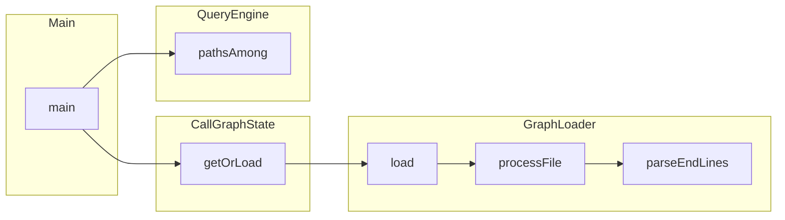

# sbt-call-graph

An SBT plugin that builds a method-level call graph from SemanticDB and lets you query it without leaving the SBT shell.

## What it does

- Parses `.semanticdb` files produced by the Scala compiler
- Builds an in-memory directed graph of method calls
- Provides SBT tasks to query paths, neighbourhoods, and cross-module edges
- Outputs JSON, interactive HTML, Mermaid, or Graphviz DOT

## Setup

Add to your project's `project/plugins.sbt`:

```scala
addSbtPlugin("io.github.2pit" % "sbt-call-graph" % "<version>")
```

Enable on the module you want to analyze in `build.sbt`:

```scala
lazy val myModule = project
  .enablePlugins(CallGraphPlugin)
```

SemanticDB generation must be enabled (already the case if you use scalafix):

```scala
semanticdbEnabled := true
```

## Commands

All commands run inside the SBT shell and trigger incremental compilation automatically.

```
# Graph diagnostics (node/edge counts)
myModule/graphIndex

# Search for a vertex by name
myModule/graphSearch MyClassName

# Neighbourhood — who calls a method and what it calls
myModule/graphVia com/example/MyClass#myMethod().
myModule/graphVia com/example/MyClass#myMethod(). --depth 3
myModule/graphVia com/example/MyClass#myMethod(). --depthIn 3 --depthOut 1

# Paths between methods (2 or more vertices)
myModule/graphPath com/example/A#foo(). com/example/B#bar().
myModule/graphPath A B C --maxDepth 15 --maxPaths 50

# Cross-module coupling
myModule/graphModule com/example/submodule

# Output format (default: json)
myModule/graphVia com/example/A#foo(). --format html
myModule/graphVia com/example/A#foo(). --format md
myModule/graphVia com/example/A#foo(). --format dot

# Filter out noisy nodes
myModule/graphVia com/example/A#foo(). --filterOut "com/example/util/.*"
```

Results are written to `target/call-graph/N.{json,html,dot,md}`. The file path is printed to stdout.

Use `--console` (or `-C`) on any command to print JSON to stdout instead of writing a file.

## Settings

Override defaults in `build.sbt`:

```scala
graphDefaultDepth    := 3          // default --depth for graphVia (default: 2)
graphDefaultDepthIn  := Some(1)    // default --depthIn (default: None → uses graphDefaultDepth)
graphDefaultDepthOut := Some(5)    // default --depthOut (default: None → uses graphDefaultDepth)
graphDefaultMaxDepth := 15         // default --maxDepth for graphPath (default: 20)
graphDefaultMaxPaths := 50         // default --maxPaths for graphPath (default: 100)
graphDefaultFormat   := "html"     // default --format: json, html, md, dot (default: json)
graphOutputDir       := "graphs"   // subdirectory under target/ (default: call-graph)
graphConsole         := true       // print to console instead of file (default: false)
```

Command-line flags always take priority over settings.

## FQN Format

Vertices use the SemanticDB symbol format:

| Element       | Separator | Example        |
|---------------|-----------|----------------|
| Package       | `/`       | `com/example/` |
| Object        | `.`       | `MyObject.`    |
| Class / Trait | `#`       | `MyClass#`     |
| Method        | `().`     | `myMethod().`  |

Full example: `com/example/MyClass#myMethod().`

Use `graphSearch` to find the exact FQN when you don't know it.

## JSON Output

```json
{
  "query": { "vertex": "com/example/A#foo().", "depthIn": 2, "depthOut": 2 },
  "found": true,
  "truncated": false,
  "nodes": [
    { "id": "com/example/A#foo().", "displayName": "foo", "file": "src/.../A.scala", "startLine": 10, "endLine": 25 }
  ],
  "edges": [
    { "from": "com/example/A#foo().", "to": "com/example/B#bar()." }
  ],
  "readHints": [
    { "file": "src/.../A.scala", "ranges": [{ "start": 10, "end": 25 }] }
  ]
}
```

`readHints` groups nodes by file and merges line ranges that are within 10 lines of each other — useful for reading relevant source efficiently.

## Examples

The [`examples/`](examples/) directory contains real output generated by running the plugin on its own codebase:

- [`graphVia.html`](examples/graphVia.html) — interactive HTML graph showing the neighbourhood of `CallGraphState.getOrLoad` (open in a browser)
- [`graphVia.json`](examples/graphVia.json) — same query as JSON with `readHints` for efficient source reading
- [`graphPath.json`](examples/graphPath.json) — call path from `Main.main` through `QueryEngine.pathsAmong` down to `GraphLoader.parseEndLines`
- [`graphPath.md`](examples/graphPath.md) — same path as a Mermaid flowchart:



## Limitations

- Method-level only — inheritance and type relationships are not in the graph
- `graphSearch` is case-sensitive
- Implicit conversions and for-comprehension desugaring may be partially missing
- `pathsAmong` searches paths in the argument order only (forward direction)

## License

MIT
