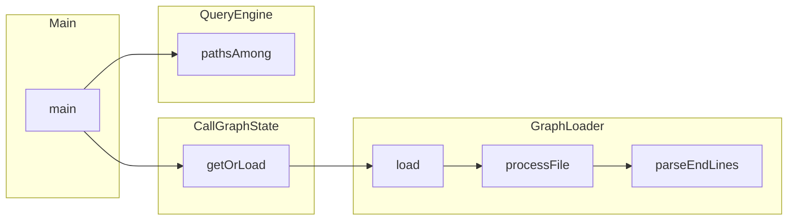

# sbt-call-graph

A Scala analyzer + MCP server that builds a method-level call graph from SemanticDB and lets you query it via Model Context Protocol tool calls.

## What it does

- Parses `.semanticdb` files produced by the Scala compiler
- Builds an in-memory directed graph of method calls
- Exposes five MCP tools to query paths, neighbourhoods, and cross-module edges
- Outputs JSON, interactive HTML, Mermaid, or Graphviz DOT

## Modules

Two modules:

- **`analyzer`** — core library + standalone CLI (`analyzer/run`)
- **`mcp-server`** — MCP server that wraps the analyzer; this is the primary query interface

## MCP Server

The `mcp-server` module exposes the analyzer as a [Model Context Protocol](https://modelcontextprotocol.io/) server so Claude (and other MCP clients) can issue call-graph queries as native tool calls.

Five tools are exposed: `graphIndex`, `graphSearch`, `graphVia`, `graphPath`, `graphModule`.

### Build

```sh
sbt mcpServer/assembly
# produces modules/mcp-server/target/scala-2.13/call-graph-mcp.jar (~43 MB)
```

### Register with Claude Code

Add to `.mcp.json` (workspace) or `~/.claude.json` (global):

```json
{
  "mcpServers": {
    "call-graph": {
      "command": "java",
      "args": [
        "-jar", "/abs/path/to/call-graph-mcp.jar",
        "--root", "/abs/path/to/your/workspace"
      ]
    }
  }
}
```

Optional: pass `--semanticdb-dir <path>` (repeatable) to override discovery. Without it the server walks `<root>` for `target/**/meta` directories.

The server requires `.semanticdb` files. If you see `compileError: true` in the response, run `sbt compile` in the workspace first.

### Worktree parameter

Every tool takes a **required** `worktree` parameter — there is no default:

- `worktree: "."` — query the **main checkout**
- `worktree: "<name>"` — query the worktree at `.worktrees/<name>/` in isolation

Omitting `worktree` (or passing `""`) is an error. This prevents silently serving a stale main-checkout graph while working inside a worktree.

### Output mode (context economy)

Tool replies are governed by a `mode` argument — `auto` (default), `inline`, or `file` — applied to every tool except `graphIndex` (always inline).

- **auto** — small responses (< 8 KB) are returned inline as JSON. Larger responses are written to `<root>/target/call-graph/N.json` and the MCP reply is replaced by a short summary:

  ```json
  {
    "file": "/abs/path/target/call-graph/7.json",
    "found": true,
    "truncated": false,
    "nodes": 142,
    "edges": 318,
    "previewNodes": ["sreo/study/StudySessionService#start().", "..."],
    "readHints": ["jq -r '.nodes[] | .displayName' …", "jq '.edges[]' …"],
    "note": "response written to disk; read with jq <file>. Pass mode=\"inline\" to inline."
  }
  ```

- **inline** — always return full JSON (escape hatch for debugging / small known queries).
- **file** — always write to disk (escape hatch for queries you know are large).

`OutputCounter` increments file names monotonically; the directory is cleaned by `sbt clean`.

### Logs

The MCP stdio transport owns stdout, so all server logs go to stderr.

## Commands (MCP tools)

```
# Graph diagnostics (node/edge counts)
graphIndex  worktree="."

# Search for a vertex by name
graphSearch  query="MyClassName"  worktree="."

# Neighbourhood — who calls a method and what it calls
graphVia  vertex="com/example/MyClass#myMethod()."  worktree="."
graphVia  vertex="com/example/MyClass#myMethod()."  worktree="."  depth=3
graphVia  vertex="com/example/MyClass#myMethod()."  worktree="."  depthIn=3  depthOut=1

# Paths between methods (2 or more vertices)
graphPath  vertices=["com/example/A#foo().", "com/example/B#bar()."]  worktree="."
graphPath  vertices=["A", "B", "C"]  worktree="."  maxDepth=15  maxPaths=50

# Cross-module coupling
graphModule  prefix="com/example/submodule"  worktree="."

# Target a worktree instead of the main checkout
graphVia  vertex="com/example/A#foo()."  worktree="BS2026-1234"
```

Results are written to `target/call-graph/N.{json,html,dot,md}`. The file path is printed to stdout.

## FQN Format

Vertices use the SemanticDB symbol format:

| Element       | Separator | Example        |
|---------------|-----------|----------------|
| Package       | `/`       | `com/example/` |
| Object        | `.`       | `MyObject.`    |
| Class / Trait | `#`       | `MyClass#`     |
| Method        | `().`     | `myMethod().`  |

Full example: `com/example/MyClass#myMethod().`

Use `graphSearch` to find the exact FQN when you don't know it.

## JSON Output

```json
{
  "query": { "vertex": "com/example/A#foo().", "depthIn": 2, "depthOut": 2 },
  "found": true,
  "truncated": false,
  "nodes": [
    { "id": "com/example/A#foo().", "displayName": "foo", "file": "src/.../A.scala", "startLine": 10, "endLine": 25 }
  ],
  "edges": [
    { "from": "com/example/A#foo().", "to": "com/example/B#bar()." }
  ],
  "readHints": [
    { "file": "src/.../A.scala", "ranges": [{ "start": 10, "end": 25 }] }
  ]
}
```

`readHints` groups nodes by file and merges line ranges that are within 10 lines of each other — useful for reading relevant source efficiently.

## Examples

The [`examples/`](examples/) directory contains real output generated by running the analyzer on its own codebase:

- [`graphVia.html`](examples/graphVia.html) — interactive HTML graph showing the neighbourhood of `CallGraphState.getOrLoad` (open in a browser)
- [`graphVia.json`](examples/graphVia.json) — same query as JSON with `readHints` for efficient source reading
- [`graphPath.json`](examples/graphPath.json) — call path from `Main.main` through `QueryEngine.pathsAmong` down to `GraphLoader.parseEndLines`
- [`graphPath.md`](examples/graphPath.md) — same path as a Mermaid flowchart:


```mermaid
flowchart LR
  subgraph "CallGraphState"
    n0["getOrLoad"]
  end
  subgraph "GraphLoader"
    n1["load"]
    n2["processFile"]
    n3["parseEndLines"]
  end
  subgraph "Main"
    n4["main"]
  end
  subgraph "QueryEngine"
    n5["pathsAmong"]
  end
  n0 --> n1
  n1 --> n2
  n2 --> n3
  n4 --> n0
  n4 --> n5
```

## Limitations

- Method-level only — inheritance and type relationships are not in the graph
- `graphSearch` is case-sensitive
- Implicit conversions and for-comprehension desugaring may be partially missing
- `pathsAmong` searches paths in the argument order only (forward direction)

## License

MIT
