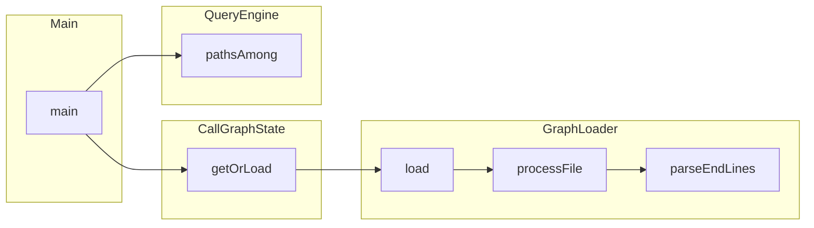

```mermaid
flowchart LR
  subgraph "CallGraphState"
    n0["getOrLoad"]
  end
  subgraph "GraphLoader"
    n1["load"]
    n2["processFile"]
    n3["parseEndLines"]
  end
  subgraph "Main"
    n4["main"]
  end
  subgraph "QueryEngine"
    n5["pathsAmong"]
  end
  n0 --> n1
  n1 --> n2
  n2 --> n3
  n4 --> n0
  n4 --> n5
```
